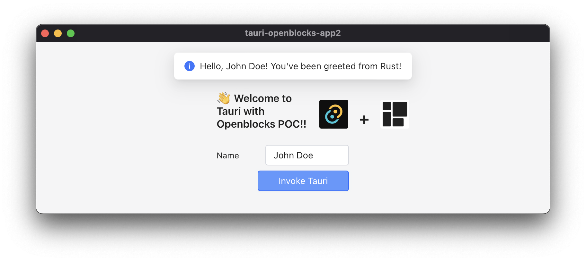

# Tauri + Openblocks PoC

[Tauri](https://tauri.app/) is an Electron alternative which uses rust application as its backend.
[Openblocks](https://github.com/openblocks-dev/openblocks) is an open source Retool alternative which helps to build web UI fast.

I, a Backend Software Engineer and DevOps Engineer, used to be suffered from writing HTML/CSS/JavaScript for building GUI application.
Recently, I was interested in these projects and thought that combining them will solve my problem.
I created this PoC to combine these.

## How I did it

### TL;DR: Use `window.__TAURI_INVOKE__`

Openblocks provides `openblocks-sdk` which supports embedding the app as React component. In this example, I embedded [this app](https://cloud.openblocks.dev/apps/63c2aa9b4c12c9123f95f4b4/preview) to tauri frontend. Also, I [edited css](./src/App.css) to fit body to viewport. Although I provided `appId` to `openblocks-sdk` to embed the app, we can pass `appDsl` instead to get rid out of communication with their server. For more information, check out the branch [appdsl](https://github.com/qbx2/tauri-with-openblocks-poc/tree/appdsl).

Openblocks supports `JavaScriptQuery` which allows us to execute arbitary code on frontend. Now we can let it invoke tauri using `window.__TAURI_INVOKE__`. That's all.

## Is it possible to call openblocks from tauri?

Yes. From the React component, add tauri event listener, then the Rust backend is possible to send message to the frontend.
Add `const appRef = useRef();` and add `ref={appRef}` to `<OpenblocksAppView />`.

You can run queries: `appRef?.current?.comp.children.queries.children[0].getView().props.comp.execute()`.

If you use OpenBlocks module, you can use `invokeMethod`. For example: `appRef?.current?.invokeMethod("callFromRust", ["value for param1"])`.

## More demos?

Check out [here](https://openblocks-dev.github.io/openblocks-sdk-demo/) for more `openblocks-sdk` demo.
